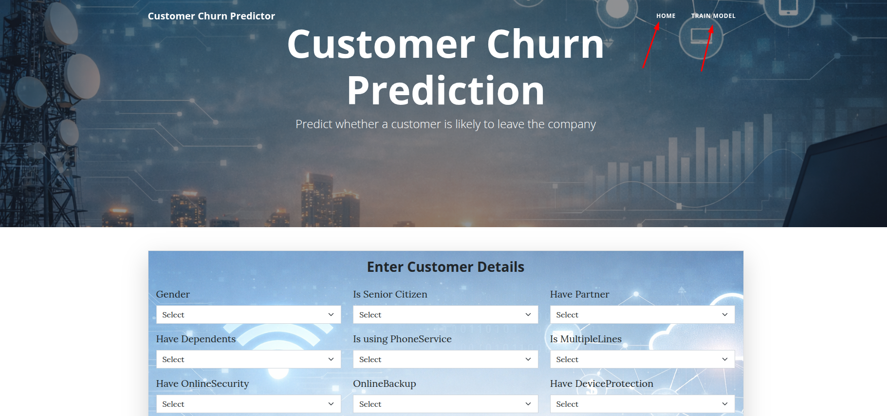
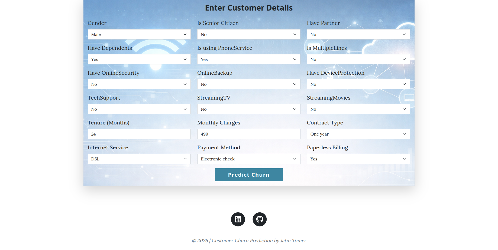
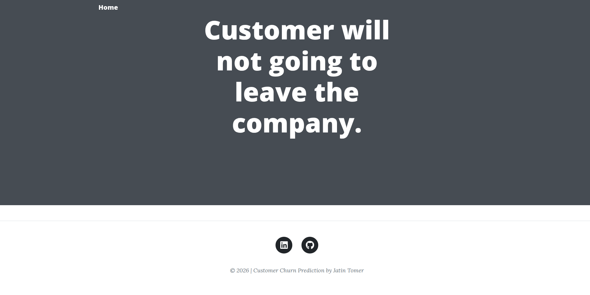
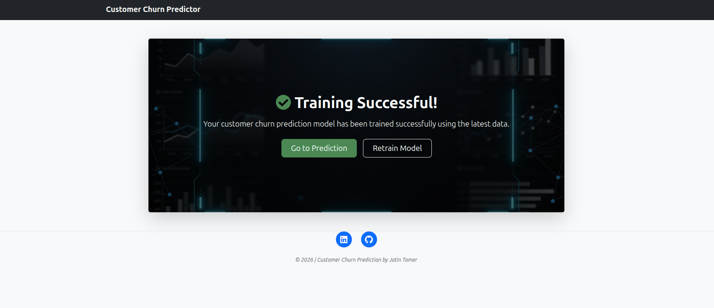

# customer-churn-prediction

## Project Overview

- This project is an end-to-end Customer Churn Prediction system for the Telecom sector, designed to predict whether a customer is likely to leave the company (churn) or stay.

- Customer churn is one of the biggest challenges in subscription-based businesses like telecom, and predicting churn early helps companies take proactive actions such as targeted offers, retention campaigns, and customer support improvements.

## Objective

- The main goal of this project is to build a machine learning solution that can:

    - Predict whether a customer will churn or not.
    - Provide a complete training  and evaluation ready pipeline
    - Support reproducible ML experiments using modern MLOps tools

## Key Features

- Simple UI to input customer details and predict churn instantly with a trained ML model.
- Automated tuning to find the best model configuration.
- Experiment Tracking with MLflow.
- Pipeline Orchestration with DVC. 
- Remote Tracking and Collaboration with DagsHub
- Docker Support
    - Run the full app directly using a Docker image.
    - No need to install dependencies manually

## Why This Project is Useful

- This project demonstrates how to build a real-world machine learning solution with:

    - Production-style ML pipelines
    - Automated reproducibility
    - Experiment tracking
    - Model versioning
    - Deployment-ready structure
  
- It is a complete example of implementing modern MLOps practices in a machine learning project.

-----

## How to run this project

- Create the virtual environment

```bash
conda create -n customer_churn python=3.11 -y
```

- Activate the virtual environment

```bash
conda activate customer_churn
```

- Install all the requirements in virtual environment

```bash
pip install -r requirements.txt
```

- Initialize the Git repository if there is no Git repository

```bash
git init
```

- Remove the following files from the .gitignore file ( .dvc, .dvcignore, dvc.lock )

- Initialize the DVC

```bash
dvc init
```

- Create the .env file and store the MLflow credentials ( MLFLOW_TRACKING_USERNAME & MLFLOW_TRACKING_PASSWORD )

```bash
touch .env
```

- Change the Mlflow configuration in the config/config.yaml

- Change the configuration in params.yaml according to your need

- Execute the pipeline by the DVC ( run where dvc.yaml file exist )

```bash
dvc repro
```

- Start the app to do the prediction

```bash
python3 app.py
```

-----


## Run the App Using Docker Image (No Setup Required)

- If you don’t want to install dependencies locally, you can run the complete Customer Churn Prediction app directly using Docker.

- [DockerHub Image](https://hub.docker.com/r/jatintomer/customer_churn_prediction)

-----

## Snapshots of the Customer Churn Prediction User Interface

### Home Page



### Prediction 



### Prediction Message



### Training Message


